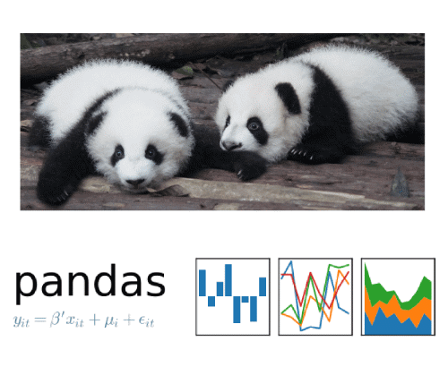
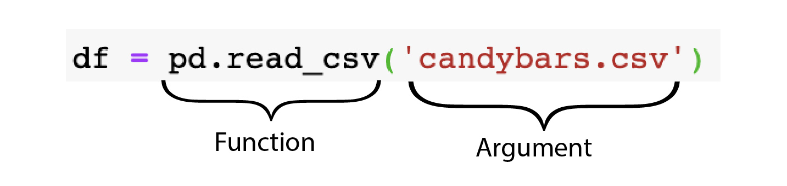

---
jupytext:
  formats: md:myst
  text_representation:
    extension: .md
    format_name: myst
    format_version: '0.8'
    jupytext_version: 1.10.3
kernelspec:
  display_name: Python 3
  language: python
  name: python3
---

# What is Pandas?

:::{admonition} Watch it
See the accompanied youtube video at <a href="https://www.youtube.com/embed/W88f5DAl9hk?rel=0?start=120&end=371" target="_blank">the link here.</a>
:::

Pandas is an add-on library to Python.


<center>



</center>


It let’s us do more things with our code, specifically with dataframes.


## Importing pandas

To analyze dataframes and load these `csv` files, we need to make sure
that we bring in the `pandas` library into Python.

Before we start writing any valuable code for loading data and doing
data analysis we need to import it with the following code.

```{code-cell} ipython3
import pandas as pd
```

## Reading in Data

Next we can bring in our data named `candybars` which is stored as a
`.csv` file.

```{code-cell} ipython3
candy = pd.read_csv('candybars.csv')
```

```{code-cell} ipython3
candy
```

let’s break this up:

- `pd` is the short form for pandas, which we are using to manipulate
  our dataframe.  
- `read_csv()` is the tool that does the job and, in this case, it is
  reading in the `csv` file named `candybars.csv`.  
- `candy` is The dataframe is now saved as an object called `candy`.

The dataframe is stored in an object named `candy` and we can inspect in
by “calling” the object name.

In these section we can differentiate between the code that we typed in
with a light grey background and it’s output which has a dark grey
background.

From this dataframe, we can see that there are 25 different candy bars
and 6 columns.

We can obtain the names of the columns using `.columns` syntax, and if
we wanted to see the dimensions of the whole dataframe we could use
`.shape` after the dataframe name.

```{code-cell} ipython3
candy.columns
```

```{code-cell} ipython3
candy.shape
```

Breaking up the code, we interpret this as:

*“From our dataframe that we saved as `candy`, tell me the `columns`
and `shape`”*


What if we don’t want to output the whole table when displaying it as
dataframe?


We can specify how many rows of the dataset to show with `.head()`
syntax.

`.head(2)` will output the first 2 rows of the dataframe.


```{code-cell} ipython3
candy.head(2)
```


We can specify any number of rows within the parentheses or we can leave
it empty which will default to the first 5 rows.

```{code-cell} ipython3
candy.head()
```


This can be really useful when we have dataframes that have hundreds or
thousands of rows long.


## Functions/Methods and Attributes


<center>



</center>

Something you may have noticed is that when we use `pd.read_csv()` we
put our instructions within the parentheses, whereas, when we use
`.shape` or `.head()` the object that we are operating on comes before
our desired command.

In Python, we use **functions**, **methods** and **attributes**. These
are special words in Python that take instructions (we call these
arguments) and do something.

### Attributes

Attributes can be distinguished from methods and functions as they do
not have parentheses.

They can be thought of as nouns or adjectives that describe an object.

Take `candy.shape` as an example.

In this case, our dataframe `candy` is our object and `.shape` is the
attribute describing it.

### Functions

Functions and methods have parentheses.  
They can be thought of as verbs that complete an action.

In the example of `pd.read_csv()`, this function does the action of
reading in our data.

This is going to be discussed in more detail later in the course but
now, simply be aware of the way we write the different instructions.


## Comments

While we write code, it’s often useful to annotate it or include
information for humans that we do not want to executed.

The easiest way to do this is with a hash (`#`) symbol. This creates a
single line comment and prevents anything written after it from being
executed by Python.

```{code-cell} ipython3
# This line does not execute anything. 
```

```{code-cell} ipython3
candy.shape  # This will output the shape of the dataframe
```

We use comments frequently in the exercises to help you understand what
to do and what our intentions are.

It’s good practice to use them to explain our code so if we or someone
else wants to read it at a later date, it’s easier to understand.

:::{admonition} Let’s apply what we learned!

1\. What is Pandas?      
a) A useful tool for data manipulation in Python    
b) A programming language    
c) A datatype    
 

2\. Which of the following statements is true?     
a) Attribute and methods can be thought of as nouns and functions as verbs           
b) Attribute can be thought of as nouns and functions and methods as verbs              
c)Functions and methods can be thought of as nouns and attributes as verbs           

:::

```{admonition} Solutions! 
:class: tip, dropdown

1. a) A useful tool for data manipulation in Python    
2. b) Attribute can be thought of as nouns and functions and methods as verbs           

```
