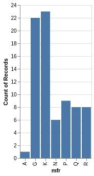
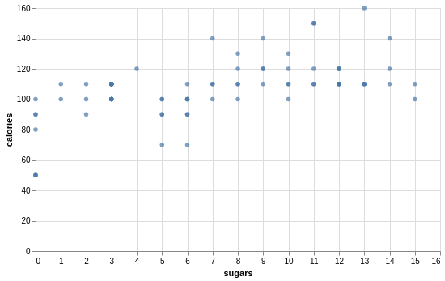
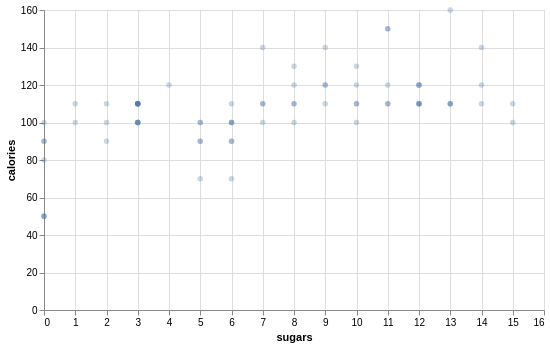
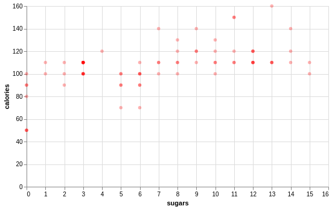
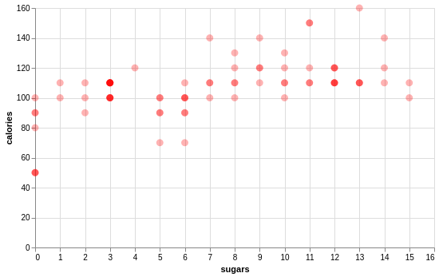
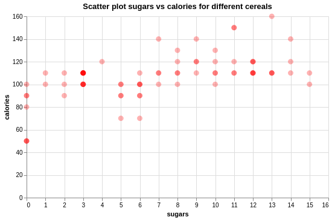

---
jupytext:
  formats: md:myst
  text_representation:
    extension: .md
    format_name: myst
    format_version: '0.8'
    jupytext_version: 1.10.3
kernelspec:
  display_name: Python 3
  language: python
  name: python3
---

# Quick viz with Altair\!

:::{admonition} Watch it
See the accompanied youtube video at <a href="https://www.youtube.com/embed/W88f5DAl9hk?rel=0?start=1945&end=2265" target="_blank">the link here.</a>
:::

If we want to visualize things using different plots, we can do that
pretty quickly and with little code\!

Take the `cereal` object we analyzed in the last section.


``` python
cereal
```

```out
                         name mfr  type  calories  protein  fat  sodium  ...  sugars  potass  vitamins  shelf  weight  cups     rating
0                   100% Bran   N  Cold        70        4    1     130  ...       6     280        25      3     1.0  0.33  68.402973
1           100% Natural Bran   Q  Cold       120        3    5      15  ...       8     135         0      3     1.0  1.00  33.983679
2                    All-Bran   K  Cold        70        4    1     260  ...       5     320        25      3     1.0  0.33  59.425505
3   All-Bran with Extra Fiber   K  Cold        50        4    0     140  ...       0     330        25      3     1.0  0.50  93.704912
4              Almond Delight   R  Cold       110        2    2     200  ...       8       1        25      3     1.0  0.75  34.384843
..                        ...  ..   ...       ...      ...  ...     ...  ...     ...     ...       ...    ...     ...   ...        ...
72                    Triples   G  Cold       110        2    1     250  ...       3      60        25      3     1.0  0.75  39.106174
73                       Trix   G  Cold       110        1    1     140  ...      12      25        25      2     1.0  1.00  27.753301
74                 Wheat Chex   R  Cold       100        3    1     230  ...       3     115        25      1     1.0  0.67  49.787445
75                   Wheaties   G  Cold       100        3    1     200  ...       3     110        25      1     1.0  1.00  51.592193
76        Wheaties Honey Gold   G  Cold       110        2    1     200  ...       8      60        25      1     1.0  0.75  36.187559

[77 rows x 16 columns]
```


Let say we are interested in the `manufacturer` column. It would be
great to express the frequency of the item in that column as a bar
chart.

But how do we do that?

To do this, we are going to use a very nifty package called Altair.

Altair is a data visualization tool that produces plots relatively
easily.

Like any other package we have seen so far, Altair needs to be imported
before we can use it.

``` python
import altair as alt
```

We can plot the `mfr` column frequencies using Altair using the
following code.


``` python
chart0 = alt.Chart(cereal).mark_bar().encode(
    x='mfr',
    y='count()'
)
chart0
```


See how quick that was? Just five lines\!

Now let’s take a moment and go through the steps of what each line
means.

To make a `bar` plot using `altair`, we follow the steps below:

1\. First, we create an `altair` plot object using `alt.chart()`.


``` python
alt.chart(...)...
```

2\. Next, we pass the dataframe we’d like to plot in to `altair.chart()`. So here, that is the `cereeal` dataframe.

``` python
alt.chart(cereal)
```

3\. But what kind of plot do we want?\! As we said before, a bar chart would be suitable for this type of data. So let’s add `.mark_bar()` to specify that.

``` python
alt.chart(cereal).mark_bar()...
```

4\. Next, we need to say what goes on the `y-axis` and the `x-axis`. We do this inside of the `encode()` call. So inside of encode, we say what should be represented on the `y-axis` and what should be represented on the `x-axis`. Here on the `x-axis`, we put the manufacturer, and on the `y-axis`, we us count: `.encode(x='mfr', y='count()')`.

``` python
alt.chart(cereal).mark_bar().encode(
  x='mfr', 
  y='count()')
```

 
`count()` is used here to count the occurrences or the number of rows in
the cereal dataframe that contains a specific manufacturer.

In general, we use `count()` if we are interested in counting the
frequency of each of elements in the `x` variable.

This gives us all the code necessary for our desired plot now.

For this example we are saving our plot as an object named `chart0`.

The important things to notice here is that we want create a
`alt.chart()` object and then specify that we want a `.mark_bar()` graph
and then specifying which column using `.encode()`.


Here is our plot again. 

``` python
chart1 = alt.Chart(cereal, width=500, height=300).mark_bar().encode(
    x='mfr',
    y='count()'
)
chart1
```


It looks a little different this time. The first
time we plotted it, it was a little too small. So inside the `alt.Chart`
call, we added a `width` and `height` argument so that we can make the
plot bigger.


What else can we plot from our original cereal dataframe named `cereal`?

Maybe we want to see the relationship between `sugars` and `calories` in
the cereals?

This would require a `scatter` plot which can be done by specifying
`mark_circle` instead of `mark_bar` and in the `encode` function, we
need to say what is going to be on the `x` and the `y` axis.

``` python
chart2 = alt.Chart(cereal, width=500, height=300).mark_circle().encode(
    x='sugars',
    y='calories'
)
chart2
```



In this case, we are putting `sugars` on the `x-axis` and `calories` on
the `y-axis`.


Something you may have noticed is that there are 77 cereals but there
doesn’t seem to be 77 data points\!

That’s because some of them are lying on top of each other with the same
sugar and calorie values.

One way we can deal with this is by changing the `opacity` of each of
those points. That way, the darker points represent that there is more
than one data point at that point in the chart, and the lightest point
represent that there is only one data point there.

We set opacity with `opacity` in the `mark_circle()` function and it
accepts values between 0 and 1, with 1 being full opacity. Here we set
it at 0.3.


``` python
chart3 = alt.Chart(cereal, width=500, height=300).mark_circle(opacity=0.3).encode(
    x='sugars',
    y='calories'
)
chart3
```



Look at that\! Now we can see there are multiple cereals that have 3.5g
of sugar with 110 calories.

What if you don’t fancy the default plot colour `blue`?

Well that’s okay, we can change the colour easily using the `color`
argument in `.mark_circle()`.

``` python
chart4 = alt.Chart(cereal, width=500, height=300).mark_circle(color='red', opacity=0.3).encode(
    x='sugars',
    y='calories'
)
chart4
```


Here we have changed the colour to `red`.

What if the data points seem a little too small? That is no problem, we
can also increase these. Again in the `mark_circle()` call. Here we add
an argument where we say the `size`. So we have changed the size from
the default to a size of 80, and we can see that the points are now
larger.

``` python
chart5 = alt.Chart(cereal, width=500, height=300).mark_circle(color='red', size=80, opacity=0.3).encode(
    x='sugars',
    y='calories'
)
chart5
```


Every good graph should have a title\!

A title provides useful information about what the plot is about.

Let’s take this opportunity to finish off our scatter plot and set the
argument `title` to something as well.

``` python
chart6 = alt.Chart(cereal, width=500, height=300).mark_circle(color='red', size=80, opacity=0.3).encode(
    x='sugars',
    y='calories'
).properties(title="Scatter plot sugars vs calories for different cereals")
chart6
```



So here we have called it *“Scatter plot sugars vs calories for
different cereals”*.

We use the `.properties()` function to do this.
