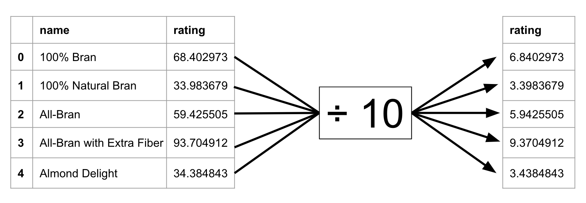
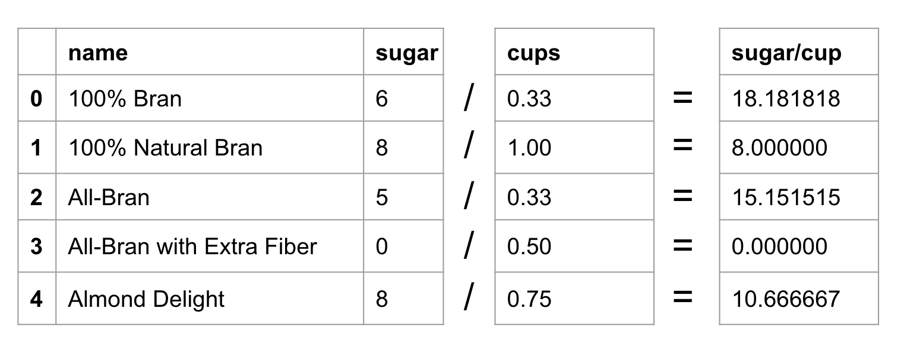

---
jupytext:
  formats: md:myst
  text_representation:
    extension: .md
    format_name: myst
    format_version: '0.8'
    jupytext_version: 1.10.3
kernelspec:
  display_name: Python 3
  language: python
  name: python3
---


# Column arithmetic and creation

:::{admonition} Watch it
See the accompanied youtube video at <a href="https://www.youtube.com/embed/WCWi1R2CQsY?start=591&end=845" target="_blank">the link here.</a>
:::


```{code-cell} ipython3
:tags: ["remove-cell"]
import pandas as pd
import numpy as np

pd.set_option('display.width', 350)
np.set_printoptions(linewidth=400)
pd.set_option('display.max_columns', 15)
pd.set_option('display.max_rows', 15)
```

Doing some sort of transformation on the columns of a dataframe will
most likely come up in your analysis somewhere and it’s not always
straightforward.

Let’s welcome back the `cereal.csv` data we have been working with.

```{code-cell} ipython3
cereal = pd.read_csv('cereal.csv')
cereal.head()
```


**Attribution:**  
*“[80 Cereals](https://www.kaggle.com/crawford/80-cereals/)” (c) by
[Chris Crawford](https://www.linkedin.com/in/crawforc3/) is licensed
under [Creative Commons Attribution-ShareAlike 3.0
Unported](http://creativecommons.org/licenses/by-sa/3.0/)*


To make things especially clear, for the next few scenarios let’s only
use the first 5 rows of the dataset.

```{code-cell} ipython3
cereal= cereal.iloc[:5]
cereal
```

Take this next scenario.

Perhaps we recently read the cereal data’s documentation explaining that
the `fat` column is being expressed as grams and we are interested in
milligrams.

How can we rectify this?

We need to multiply each of the row’s fat values by 1000.

 

Here is where some magic happens.

Python doesn’t require us to make a whole column filled with 1000s to
get the result we want.

It simply multiplies each value by 1000. (In Python we use `*` for
multiplication.)

So our original fat column in the cereal dataframe is transformed from this:

```{code-cell} ipython3
cereal['fat']
```

To this:

```{code-cell} ipython3
cereal['fat'] * 1000
```

See how each value has changed?

Note that when we do any type of operations on columns, we use single
square brackets.


We can do the same thing with most operations. Let’s divide the rating
of each cereal by 10 so that it lies on a 10 point scale.


```{code-cell} ipython3
cereal['rating'] 
```

The ratings column gets transformed to single digits instead of double
digits now.

```{code-cell} ipython3
cereal['rating'] / 10
```

Every row’s value is changed by the operation.


 


We are not limited to simply taking a column and transforming it by a
single number, say by multiplying or dividing.

We can do operations involving multiple columns as well. Perhaps we
wanted to know the amount of sugar (`sugar`) per cup of cereal (`cups`).

The expected result would look something like this diagram.


 

To get our desired output of sugar content per cup our code looks like
this.

```{code-cell} ipython3
cereal['sugars'] / cereal['cups']
```

Remember that with any column operation we use only single square
brackets on our columns.


Each sugar row value is divided by its corresponding cups value.


Just to stress the point of why we use single square brackets for our
operations, here is what happens when we use double square brackets.

```{code-cell} ipython3
cereal[['sugars']] / cereal[['cups']]
```

This doesn’t appear very useful.

## Column Creation

Up until now, all of these operations have been done without being added
to our cereal dataframe.

Let’s explore how we can add new columns to a less detailed version of
our cereal dataframe.

We’ll be working with a smaller dataframe containing only a few columns
columns so that it’s easier to follow the examples.

```{code-cell} ipython3
cereal = pd.read_csv('cereal.csv', usecols=['name', 'mfr','type', 'fat', 'sugars', 'weight', 'cups','rating'])
cereal
```

In the next scenario, we have decided that our `weight` column should
show the weight of each cereal in grams instead of ounces.

We are going to save the conversion factor of grams to ounces in an
object named `oz_to_g`.

Let’s start with just the operation for this.


```{code-cell} ipython3
oz_to_g = 28.3495
cereal['weight'] * oz_to_g
```

Next, we combine our operation with the implementation of adding it as a
new column to the dataframe. The verb `.assign()` allows us to specify a
column name to our result using an equal sign `=`.

We are going to name our new column `weight_g` (for grams).


Just like we did earlier in the module, we need to save the dataframe to
an object when making changes involving columns. This will permanently
save the column `weight_g` to the dataframe `cereal`.

```{code-cell} ipython3
cereal = cereal.assign(weight_g=cereal['weight'] * oz_to_g)
cereal.head()
```

Let’s try another example.

This time we want to save our sugar content per cereal cup as a column
in our existing dataframe.

Here, you can see the operation by itself, just for teaching
purposes. 

```{code-cell} ipython3
cereal['sugars'] / cereal['cups']
```

Below, we combine our calculation with `assign()`,
naming the column `sugar_per_cup`.

```{code-cell} ipython3
cereal = cereal.assign(sugar_per_cup=cereal['sugars'] / cereal['cups'])
cereal.head()
```

:::{admonition} Let’s apply what we learned!

1\. What is the result if we multiply 2 columns together using the syntax 

```
df[['Column_A']] * df[['Column_B']]
```

a) A new column in our dataframe with each column value multiplied together for each row.      
b) A single column with each column value multiplied together for each row.            
c) A dataframe containing 2 new columns with `NaN` values.           

        

2\. What is the correct syntax to multiply `Column_A` and `Column_B` from dataframe `df` and save it as a new column named `new_column`?      
a) `df = df.assign('new_column'=df['Column_A'] * df['Column_B'])`        
b) `df = df.assign(new_column=df['Column_A'] * df['Column_B'])`        
c) `df = df.assign[new_column=df('Column_A') * df('Column_B')]`        

:::

```{admonition} Solutions!
:class: tip, dropdown

1. c) A dataframe containing 2 new columns with <code>NaN</code> values.        
2. b) `df = df.assign(new_column=df['Column_A'] * df['Column_B'])`        

```
